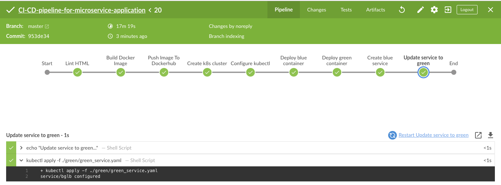
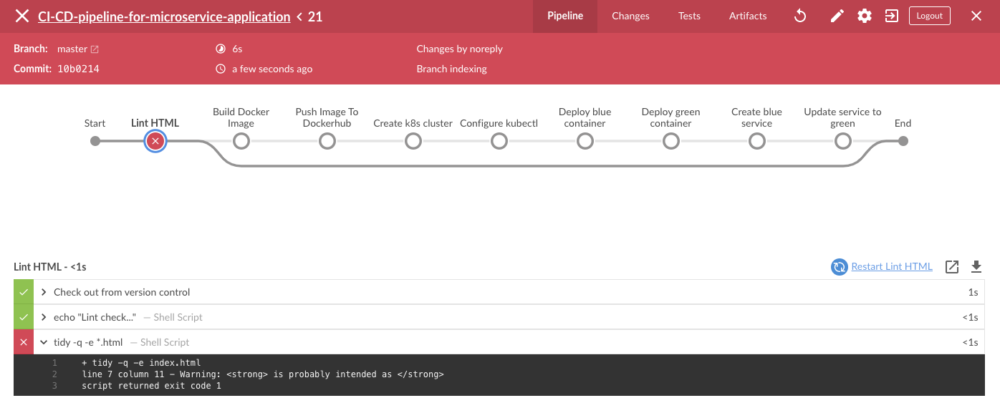
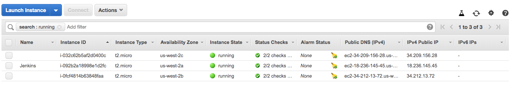
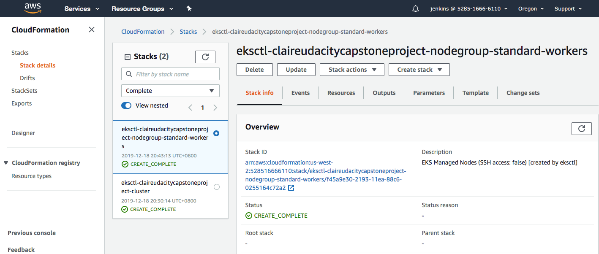
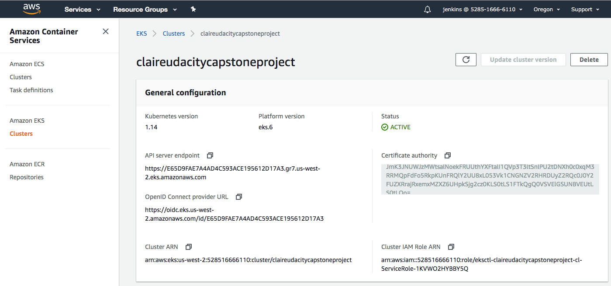
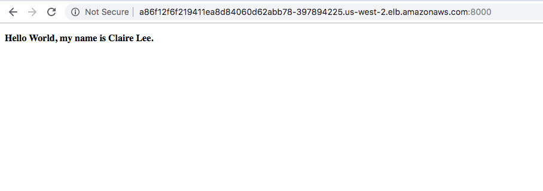

# CI-CD-pipeline-for-microservice-application
Capstone Project [Udacity Cloud DevOps Engineer Nanodegree]

## Project Overview
### Project Description
Develop a CI/CD pipeline for microservice application with blue/green deployment. Start with a linting check, push the built Docker conatiner(s) to the Docker repositiry, and then deploy these Docker container(s) to a small Kubernetes cluster.

### Project Procedure
- Lauch a EC2 instance
  - AMI: Ubuntu Server 18.04 LTS
- Install required dependencies
  - Jenkins
  - Docker
  - pip
  - AWS CLI
  - eksctl
  - kubectl
  - lint
- Install required plugins in Jenkins
  - Blue Ocean
  - Pipeline AWS steps
  - Kubernetes
- Build pipeline
  - Docker containers
  - Kubernetes cluster

### Project Results
1. Jenkins pipeline after finishing deployment

2. Test lint failure in Jenkins pipeline

3. AWS EC2 insatnces after finishing deployment

4. AWS EKS cluster

5. AWS CloudFormation stacks

6. Web page

